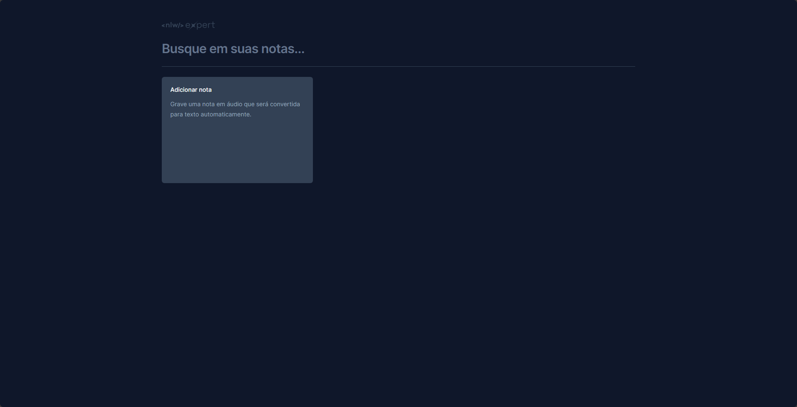
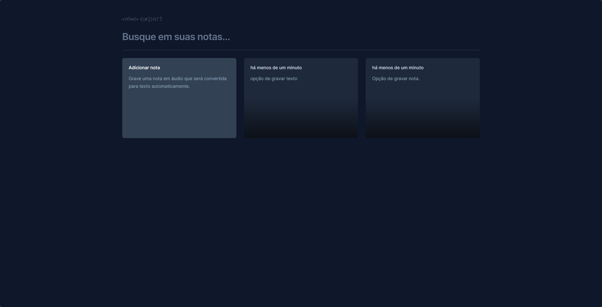
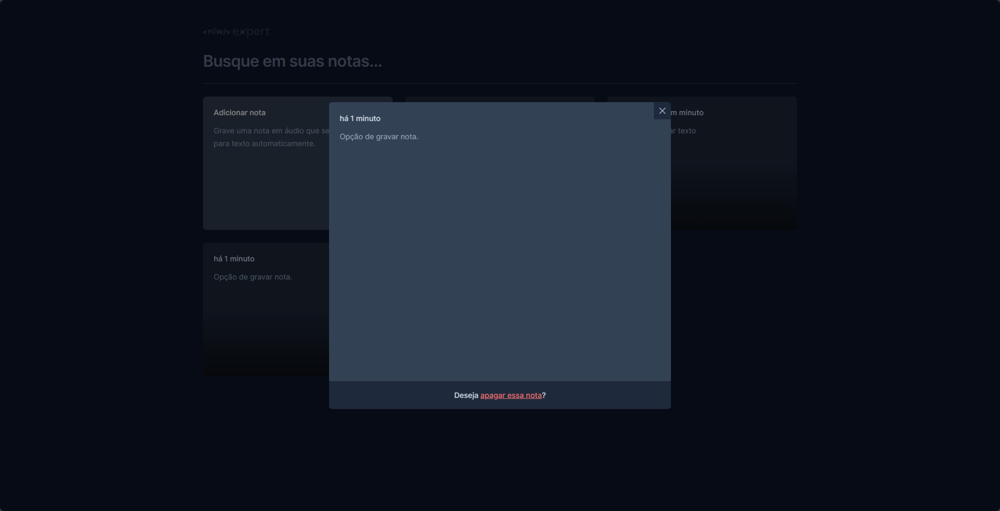

### NLW-Expert

#

## Trilha - React

Projeto desenvolvido com React

- Vite
- TailwindCSS
- Typescript
- Componentização
- Radix UI (para uso de modal)
- date-fns (para tratamento de datas)
- Sonner (para exibição de toasts)
- Hooks ==> useStates()
- gravação de dados no LocalStorage() do navegador
- utilização de API para gravar notas de Audio e transcrição para texto utilizando SpeechRecognition
- Props e Functions

Imagens das aplicação

